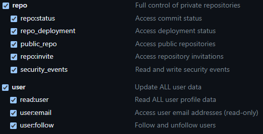

# GitHubStats application
> Web app for obtaining data from GitHub API and providing user statistics.

## Table of Contents
* [General information](#general-information)
* [Technologies used](#technologies-used)
* [Setup](#setup)

## General information
The application communicates with GitHub API in order to retrieve some user data like name, date of joining, number of public and private repositories, share of programming languages used in all (public and private) repositories, number of contributions per year, etc.\
Then, it creates an infographic with obtained data.

## Technologies used
- ASP.NET
- React.js

## Setup

### Requirements
* Visual Studio
* .NET 6 or higher
* Node.js

### GitHub Token
A GitHub access token is required for the application to obtain access to user's data.

1. Go to [https://github.com/settings/tokens](https://github.com/settings/tokens)

2. Click on
`Generate new token > Generate new token (classic)`
and create a new token with following scopes selected:\


### Installation

1. Clone the repository:

```
git clone https://github.com/arekjg/GitHubStats.git
cd GitHubStats
```

2. Open `GitHubStats.sln` in Visual Studio

3. Start the project

### Usage

1. Enter your credentials (GitHub login and Personal access token)

2. Generate stats

